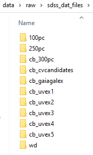
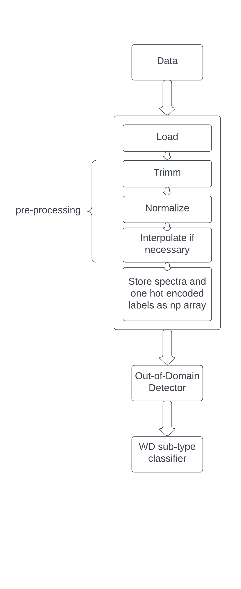

White Dwarf Spectral Classification
==============================

The following github consists of a machine learning pipeline for white dwarfs spectroscopic classification.
The spectra comes from  SDSS's Baryon Oscillation Spectroscopic Survey (BOSS), and relies on the manual labeling
done by several astronomers.

Currently, this pipeline makes use of spectrum data stored in .dat format, while the labels are stored in several csv files, along with other useful information.
The spectrum and the label can be linked by the target ID and the modified julian date (MJD) of the object, which are included
in the csv files.

Requirements
==============================

Development of this modules was made using python 3.9.12. You can use conda (run ```conda create --name <env_name> python=3.9.12 ```) or another python enviroment manager to install python and pip. After that, you can run ```pip install -r requirements.txt``` to install the required packages.


Data Download - Using only dat files from SDSS
==============================

You can check in the project organization section below that there is supposed to be a data folder at the top level for the project, but there is no data folder in at this level in the github repo. Currently, We have to create this folder and download the data manually.

Please run the ```make_data_folders.py``` script of the github project to make the necessary folders, or copy the following structure manually at the top level (as shown below in the project organization section). Then, add the following data to each folder:

## SDSS Spectroscopy Data: label data and .dat files

We need to add the label data and the spectrum data to the "raw" folder. For the spectrum data, you will need to reach SDSS rsync mirror. For Linux/Mac, you can run the command ```rsync -avz --exclude={'*.gif','Exposures/'} rsync://sdss5@dtn.sdss.org/sdsswork/users/u6033609/v6_0_4/ .``` to download the .dat files (this command will exclude gif files and the Exposure/ folder.) given that you have the appropiate credentials. For windows, I recommend using running ubuntu inside inside windows using <a target="_blank" href="https://ubuntu.com/tutorials/install-ubuntu-on-wsl2-on-windows-10#1-overview">Windows Subsystem for Linux</a>

Copy the downloaded folders to the "sdss_dat_files" folder. The folder structure should look like this:



For the label data, go to the sdss wiki <a target="_blank" href="https://wiki.sdss.org/display/MWM/v6_0_2+spectroscopic+classification">spectroscopic classification section</a> and download the google drive folder containing the labels. Extract the folder files (csv files) and copy them inside the "label_data" folder.

## Boris' Data: .fits data from sharepoint

Boris' data aims at reinforcing minority classes for our very unbalanced set. To download it, simply go to the sharepoint and download both the fits spectrums and the crossmatch info. Once downloaded, the folder structure should look like this:

Solarized dark             |  Solarized Ocean           |  Solarized Ocean      
:-------------------------:|:-------------------------: |:-------------------------:
  |    |  

Project Organization
==============================

Below you can see a description for the intended use of each folder and relevant file for the project.

------------

    ├── LICENSE            <- Currently None
    ├── Makefile           <- Makefile with commands like `make data` or `make train`
    ├── README.md          <- The top-level README for developers using this project.
    ├── READMEimgs         <- Images for the readme page.
    ├── data
    │   ├── external       <- Data from third party sources.
    │   ├── interim        <- Intermediate data that has been transformed.
    │   ├── processed      <- The final, canonical data sets for modeling.
    │   └── raw            <- The original, immutable data dump.
    │       │   
    │       ├── label_data
    │       └── sdss_dat_files
    │
    ├── docs               <- A default Sphinx project; see sphinx-doc.org for details
    │
    ├── models             <- Trained and serialized models, model predictions, or model summaries
    │
    ├── notebooks          <- Jupyter notebooks. Naming convention is a number (for ordering),
    │                         the creator's initials, and a short `-` delimited description, e.g.
    │                         `1.0-jqp-initial-data-exploration`.
    │
    ├── references         <- Data dictionaries, manuals, and all other explanatory materials.
    │
    ├── reports            <- Generated analysis as HTML, PDF, LaTeX, etc.
    │   └── figures        <- Generated graphics and figures to be used in reporting
    │
    ├── requirements.txt   <- The requirements file for reproducing the analysis environment, e.g.
    │                         generated with `pip freeze > requirements.txt`
    │
    ├── scripts            <- folder with useful scripts.
    │
    ├── setup.py           <- makes project pip installable (pip install -e .) so src can be imported
    ├── src                <- Source code for use in this project.
    │   ├── __init__.py    <- Makes src a Python module
    │   │
    │   ├── data           <- Scripts to load and pre-process data.
    │   │   └── make_dataset.py
    │   │
    │   ├── features       <- Scripts to turn raw data into features for modeling
    │   │   └── build_features.py
    │   │
    │   ├── models         <- Scripts to train models and then use trained models to make
    │   │   │                 predictions
    │   │   ├── predict_model.py
    │   │   └── train_model.py
    │   │
    │   └── visualization  <- Scripts to create exploratory and results oriented visualizations
    │       └── visualize.py
    │
    └── tox.ini            <- tox file with settings for running tox; see tox.readthedocs.io


--------

<p><small>Project based on the <a target="_blank" href="https://drivendata.github.io/cookiecutter-data-science/">cookiecutter data science project template</a>. #cookiecutterdatascience</small></p>

Jupyter Notebooks
==============================

Inside the "notebooks" folder there are annotated explorations of the data, following all the way trough to implementing machine learning models for classification. Each otebook result should be stored under a folder of the same name, inside the 'notebooks' directory. 'Once the project is going you can execute this notebooks on your computer! By default, no folder inside the notebook sub-folder is stored, as some generated files are too heavy for this free github. 

Most notebooks require files of other notebooks in order to be exceuted, and as they were made for exploration, there has been some clear evolution between them. My recommended execution order for the notebooks is:

1. notebooks\1.0-jrb-data-preprocessing.ipynb : First exploration of sdss data using available .dat files downloaded from sdss, and first exploration of the spectroscopic labeling campaign data. In this notebook we define some simple criteria so as to build our first train, validation and test sets from sdss data.
2. notebooks\1.0-jrb-first_model_test.ipynb : First model exploration for WD sub-type classification. We explore simple fully connected ANN  and some basic CNN model arquitecture, and show evidence of disparity in the results achieved using an undersampling strategy and an oversampling strategy for balancing the dataset.
3. notebooks\1.0-jrb-domain-detector.ipynb : First domain detector using random forest and sdss data. The domain detector's task is to recognize whether or not the spectrum data is actually a WD, or in other words, if the spectrum data being analyzed is inside the "domain" of the WD sub-type classifier.
4. notebooks\1.0-jrb-external-data-exploration.ipynb : The data supplied by boris (available at our group's sharepoint storage, treated as external data in this project) is processed in a similar fashion to the sdss data.  This allows us to concatenate the numpy arrays generated from both datasets in order to do model training over the expanded set, as this external data aims at reinforcing the minority classes.
5. notebooks\2.0-jrb-external-data-exploration.ipynb : Similar to the last notebook, the sdss_dr7 dataset (available at our group's sharepoint storage, treated as external data in this project) is processed in a similar fashion to the sdss data.  This allows us to concatenate the numpy arrays generated from both datasets in order to do model training over the expanded set. 

General Data Flow
==============================

The general data flow for classifiying spectra can be seen in the following image:

